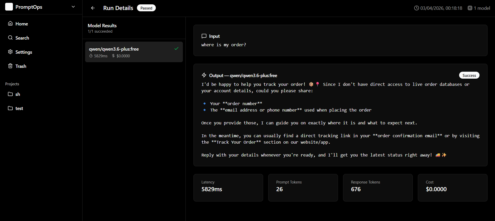
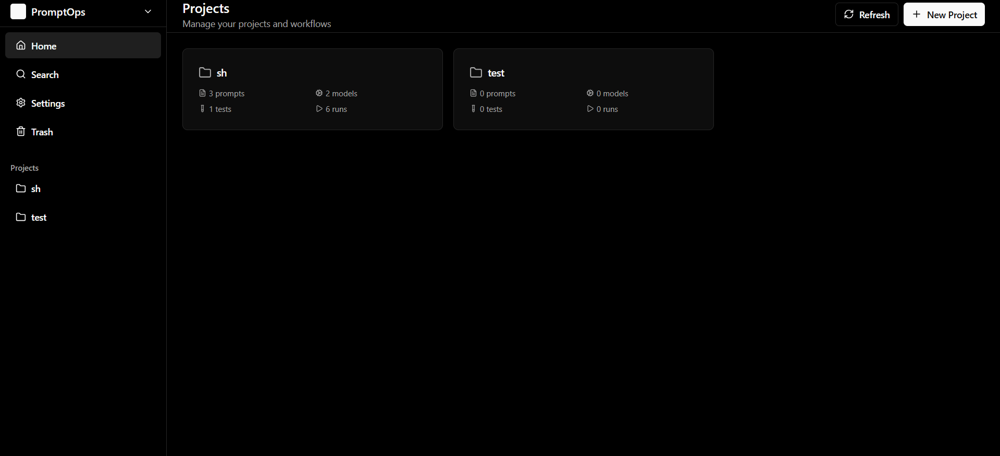

# 🔧 PromptOps

> A full-stack prompt engineering workbench for testing, evaluating, and optimizing prompts across multiple LLMs.

## 🌐 Live Demo
**[prompt-ops.vercel.app](https://prompt-ops.vercel.app/)**

---

## 🖼️ Preview

---

## 🚀 What is PromptOps?
PromptOps is a developer-focused platform for **systematically improving prompts** instead of guessing what works.

It allows you to:
* Run prompts across multiple models
* Compare outputs side-by-side
* Evaluate responses using structured test cases
* Track latency and cost
* Version and iterate on prompts like code

---

## ❗ The Problem
Prompt engineering today is messy:
* You tweak prompts blindly
* Results vary across models
* No structured way to evaluate quality
* No version control for iterations
* Cost and latency are often ignored

PromptOps solves this by turning prompt engineering into a **repeatable, measurable workflow**.

---

## ✨ Features

### 🧠 Multi-Model Comparison
Run the same prompt across multiple LLMs and compare outputs instantly.

### 📊 Evaluation with Test Cases
Define structured test cases and evaluate outputs using AI-based scoring.

### 💸 Cost & Latency Tracking
Understand the real-world tradeoffs between models:
* Response time
* Token usage
* Estimated cost

### 🧾 Prompt Versioning
Track prompt iterations and experiment safely without losing previous versions.

### 🗂️ Project-Based Workflow
Organize prompts, tests, and experiments into structured projects.

---

## 🏗️ Tech Stack

**Frontend** — React · TypeScript · Vercel

**Backend** — FastAPI · Python · Render

**AI Integration** — OpenRouter (multi-model access)

---

## 🧪 Technical Highlights
* Parallel execution across multiple LLM providers
* Unified interface over different model APIs
* Token usage and cost estimation
* AI-as-judge evaluation pipeline
* Structured prompt versioning system
* Project-based experiment organization

---

## 🧠 Why This Project Matters
PromptOps is not just a UI wrapper around LLM APIs.

It addresses a real gap in AI development:
> Turning prompt engineering into a **disciplined, testable, and iterative process**

---

## 📌 Roadmap
* [ ] Prompt diffing between versions
* [ ] Batch dataset testing
* [ ] Prompt regression testing
* [ ] Shareable experiment links
* [ ] Custom evaluation criteria
* [ ] CI-style prompt validation

---

## 🤝 Contributing
Contributions, ideas, and feedback are welcome.
Feel free to open issues or submit pull requests.

---

## 📄 License
MIT License

---
